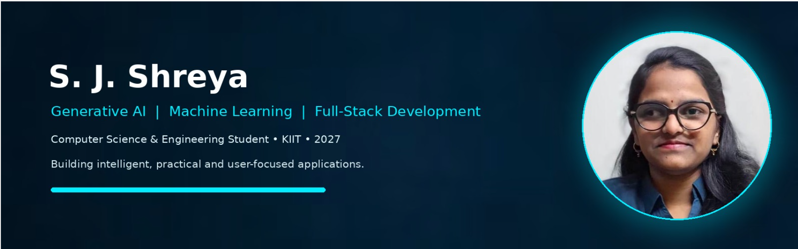

<!-- ===================== BANNER ===================== -->

  

  <b>Always learning • building • improving</b>

---

## 👋 About Me

- 🎓 Computer Science & Engineering Student at **KIIT**
- 🤖 Interested in **Generative AI, Machine Learning & NLP**
- 💻 Experienced with **Python, AI/ML & Full-Stack Development**
- 🧠 Exploring **LLMs, RAG, LangChain & AI-powered systems**
- 🚀 Focused on building practical and user-focused applications

---

## 🛠️ Tech Stack

| Area | Technologies |
|---|---|
| **Languages** | Python • Java • C • SQL |
| **AI / ML** | Machine Learning • Generative AI • NLP • LLMs |
| **GenAI** | RAG • LangChain • Prompt Engineering |
| **Web** | HTML • CSS • JavaScript • React |
| **Backend** | Python • Flask |
| **Database / Tools** | MySQL • PostgreSQL • Git • GitHub |

---

## 💼 Experience

| Role | Organization | Key Work |
|---|---|---|
| **Generative AI Intern** | Tata Consultancy Services (TCS) | Generative AI concepts, LLMs, RAG, LangChain & AI-based workflows |
| **PwC Advisory** | Advisory Launchpad Program | Data Engineering concepts, modern data systems, Python & Generative AI |

---

## 📜 Certifications

| Certification | Organization |
|---|---|
| **Prompt Engineering for ChatGPT** | Vanderbilt University |
| **Generative AI: Prompt Engineering Basics** | IBM |
| **Generative AI: Introduction and Applications** | IBM |
| **IBM DevOps and Software Engineering** | IBM |
| **Corporate Governance** | Coursera |
| **Business for Good: Fundamentals of Corporate Responsibility** | London Business School |
| **Ethical Decision Making for Success in the Tech Industry** | University of Colorado Boulder |

---

## 🚀 Featured Projects

| Project | Description |
|---|---|
| 🔎 **Fake Information Detection** | ML-based system for identifying potentially misleading information using NLP techniques. |
| ⌨️ **Stress Detection via Typing** | Analyzes typing behavior and patterns to identify stress-related indicators. |
| 📄 **Offline Resume Screening** | Uses NLP and semantic similarity to compare resumes with job requirements locally. |
| 🤝 **AI Meeting Action Tracker** | Extracts meeting action items and important information using Generative AI. |
| 🗃️ **AI SQL Generator** | Converts natural-language questions into SQL queries using AI. |
| 🧠 **RAG & LLM Applications** | Experiments with Retrieval-Augmented Generation and LLM-powered applications. |

---

## 🎯 Current Focus

`Generative AI` • `Machine Learning` • `NLP` • `RAG` • `LLMs` • `Full-Stack`

---

## 🔗 Connect With Me

  

---

  💙 <b>Building today for a smarter tomorrow.</b>

